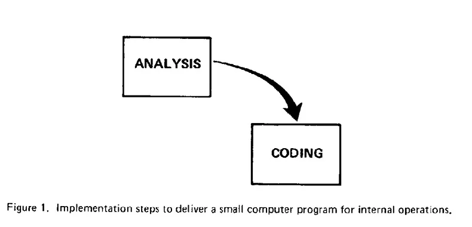
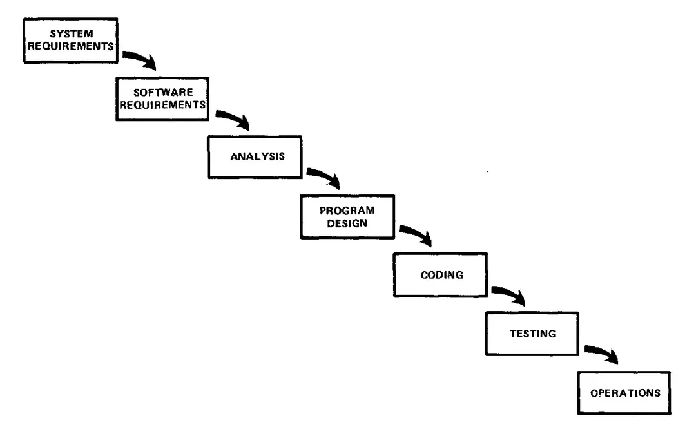
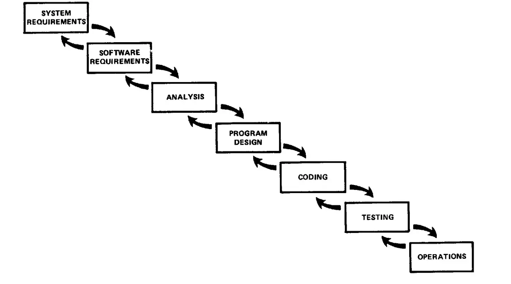
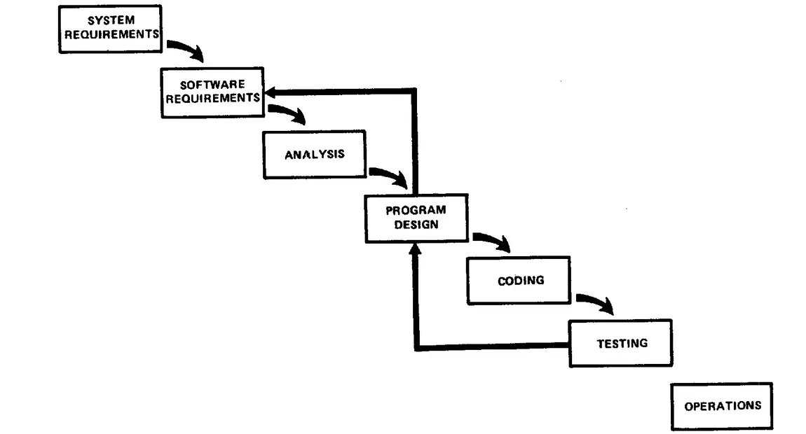
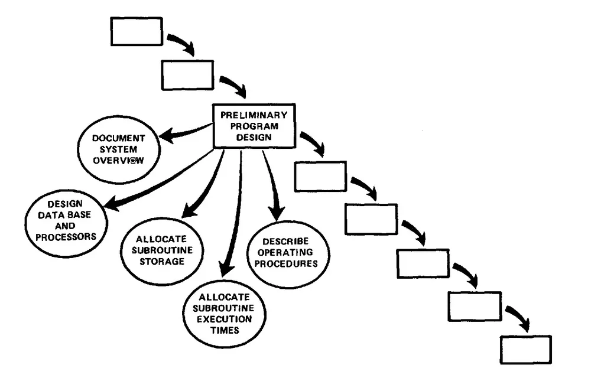
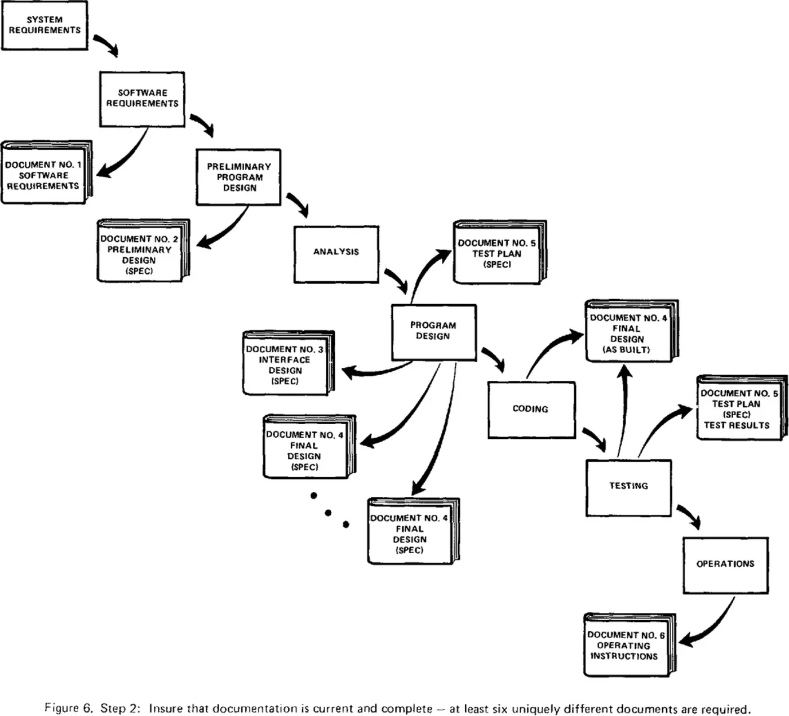
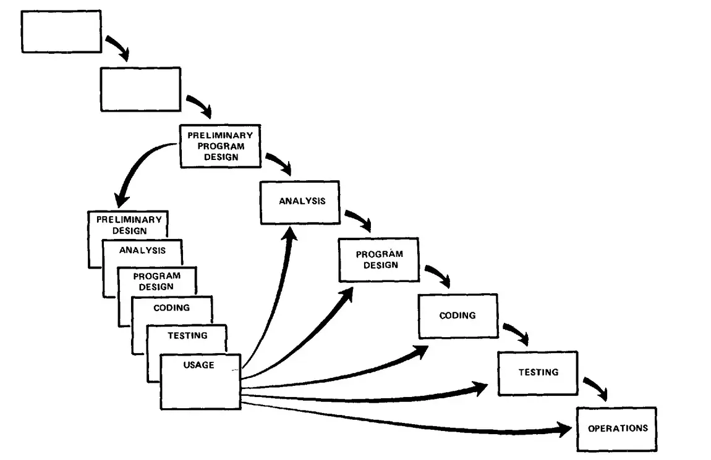
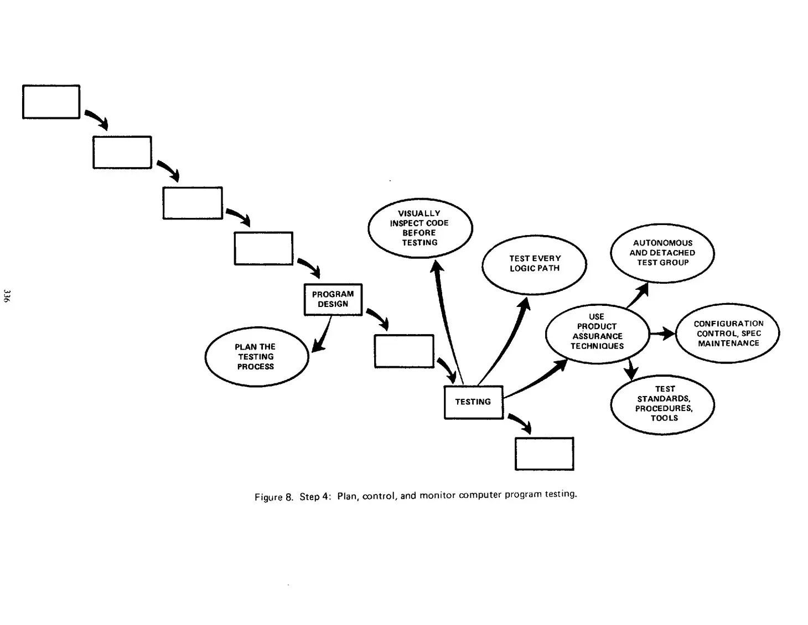
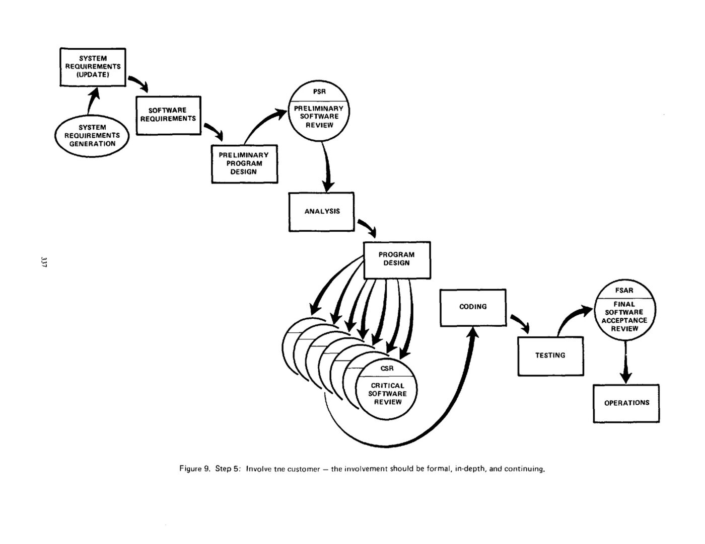
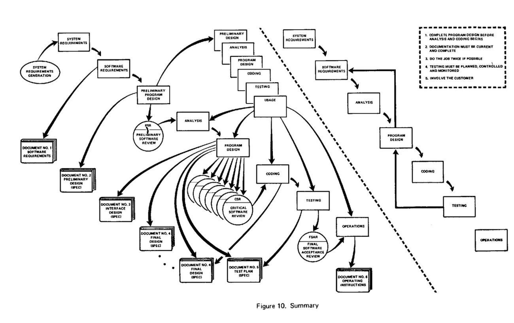

# MANAGING THE DEVELOPMENT OF LARGE SOFTWARE SYSTEMS

## INTRODUCTION

I am going to describe my personal views about managing large software developments. I have had various assignments during the past nine years, mostly concerned with the development of software packages for spacecraft mission planning, commanding and post-flight analysis. In these assignments I have experienced different degrees of success with respect to arriving at an operational state, on time, and within costs. I have become prejudiced by my experiences and I am going to relate some of these prejudices in this presentation.

## COMPUTER PROGRAM DEVELOPMENT FUNCTIONS

There are two essential steps common to all computer program developments, regardless of size or complexity. There is first an analysis step, followed second by a coding step as depicted in Figure 1. This sort of very simple implementation concept is in fact all that is required if the effort is sufficiently small and if the final product is to be operated by those who built it — as is typically done with computer programs for internal use. It is also the kind of development effort for which most customers are happy to pay, since both steps involve genuinely creative work which directly contributes to the usefulness of the final product. An implementation plan to manufacture larger software systems, and keyed only to these steps, however, is doomed to failure. Many additional development steps are required, none contribute as directly to the final product as analysis and coding, and all drive up the development costs. Customer personnel typically would rather not pay for them, and development personnel would rather not implement them. The prime function of management is to sell these concepts to both groups and then enforce compliance on the part of development personnel.

Figure 1. Implementation steps to deliver a small computer program for internal operations.

**Figure summary:** Simple two-step flow diagram. A rectangular box labeled "ANALYSIS" (upper left) has a thick curved arrow leading down and to the right into a second rectangular box labeled "CODING" (lower right), showing that a small computer program for internal operations is produced by a single analysis step followed by a single coding step.

A more grandiose approach to software development is illustrated in Figure 2. The analysis and coding steps are still in the picture, but they are preceded by two levels of requirements analysis, are separated by a program design step, and followed by a testing step. These additions are treated separately from analysis and coding because they are distinctly different in the way they are executed. They must be planned and staffed differently for best utilization of program resources.

Figure 3 portrays the iterative relationship between successive development phases for this scheme. The ordering of steps is based on the following concept: that as each step progresses and the design is further detailed, there is an iteration with the preceding and succeeding steps but rarely with the more remote steps in the sequence. The virtue of all of this is that as the design proceeds the change process is scoped down to manageable limits. At any point in the design process after the requirements analysis is completed there exists a firm and closeup, moving baseline to which to return in the event of unforeseen design difficulties. What we have is an effective fallback position that tends to maximize the extent of early work that is salvageable and preserved.

*Figure 2.* Implementation steps to develop a large computer program for delivery to a customer.

I believe in this concept, but the implementation described above is risky and invites failure. The problem is illustrated in Figure 4. The testing phase which occurs at the end of the development cycle is the first event for which timing, storage, input/output transfers, etc., are experienced as distinguished from analyzed. These phenomena are not precisely analyzable. They are not the solutions to the standard partial differential equations of mathematical physics for instance. Yet if these phenomena fail to satisfy the various external constraints, then invariably a major redesign is required. A simple octal patch or redo of some isolated code will not fix these kinds of difficulties. The required design changes are likely to be so disruptive that the software requirements upon which the design is based and which provides the rationale for everything are violated. Either the requirements must be modified, or a substantial change in the design is required. In effect the development process has returned to the origin and one can expect up to a 100-percent overrun in schedule and/or costs.

One might note that there has been a skipping-over of the analysis and code phases. One cannot, of course, produce software without these steps, but generally these phases are managed with relative ease and have little impact on requirements, design, and testing. In my experience there are whole departments consumed with the analysis of orbit mechanics, spacecraft attitude determination, mathematical optimization of payload activity and so forth, but when these departments have completed their difficult and complex work, the resultant program steps involve a few lines of serial arithmetic code. If in the execution of their difficult and complex work the analysts have made a mistake, the correction is invariably implemented by a minor change in the code with no disruptive feedback into the other development bases.

However, I believe the illustrated approach to be fundamentally sound. The remainder of this discussion presents five additional features that must be added to this basic approach to eliminate most of the development risks.

**Figure summary:** The figure shows a strictly sequential, one-directional waterfall chain: seven boxes labeled SYSTEM REQUIREMENTS → SOFTWARE REQUIREMENTS → ANALYSIS → PROGRAM DESIGN → CODING → TESTING → OPERATIONS, each connected to the next by a single forward arrow cascading diagonally downward, with no feedback loops.

**Figure summary:** A cascade (staircase) diagram in which seven boxed phases descend from upper-left to lower-right — SYSTEM REQUIREMENTS → SOFTWARE REQUIREMENTS → ANALYSIS → PROGRAM DESIGN → CODING → TESTING → OPERATIONS. Curved arrows feed each phase into the next, with small feedback arrows looping back only between adjacent (successive) phases, illustrating that iterative interaction is ideally confined to successive steps.

Figure 3. Hopefully, the iterative interaction between the various phases is confined to successive steps.

**Figure summary:** The same seven-phase cascade (SYSTEM REQUIREMENTS → SOFTWARE REQUIREMENTS → ANALYSIS → PROGRAM DESIGN → CODING → TESTING → OPERATIONS), but with an additional large feedback line running from TESTING back up to PROGRAM DESIGN and to SOFTWARE REQUIREMENTS. This illustrates that in practice, design iterations are never confined to the successive steps — deficiencies found late force rework far back upstream.

Figure 4. Unfortunately, for the process illustrated, the design iterations are never confined to the successive steps.

## STEP 1: PROGRAM DESIGN COMES FIRST

The first step towards a fix is illustrated in Figure 5. A preliminary program design phase has been inserted between the software requirements generation phase and the analysis phase. This procedure can be criticized on the basis that the program designer is forced to design in the relative vacuum of initial software requirements without any existing analysis. As a result, his preliminary design may be substantially in error as compared to his design if he were to wait until the analysis was complete. This criticism is correct but it misses the point. By this technique the program designer assures that the software will not fail because of storage, timing, and data flux reasons. As the analysis proceeds in the succeeding phase the program designer must impose on the analyst the storage, timing, and operational constraints in such a way that he senses the consequences. When he justifiably requires more of this kind of resource in order to implement his equations it must be simultaneously snatched from his analyst compatriots. In this way all the analysts and all the program designers will contribute to a meaningful design process which will culminate in the proper allocation of execution time and storage resources. If the total resources to be applied are insufficient or if the embryo operational design is wrong it will be recognized at this earlier stage and the iteration with requirements and preliminary design can be redone before final design, coding and test commences.

How is this procedure implemented? The following steps are required.

1) Begin the design process with program designers, not analysts or programmers.

2) Design, define and allocate the data processing modes even at the risk of being wrong. Allocate processing, functions, design the data base, define data base processing, allocate execution time, define interfaces and processing modes with the operating system, describe input and output processing, and define preliminary operating procedures.

3) Write an overview document that is understandable, informative and current. Each and every worker must have an elemental understanding of the system. At least one person must have a deep understanding of the system which comes partially from having had to write an overview document.

**Figure summary:** Flow diagram for Step 1. A central box labeled "PRELIMINARY PROGRAM DESIGN" fans out via arrows to five circles: "DOCUMENT SYSTEM OVERVIEW", "DESIGN DATA BASE AND PROCESSORS", "ALLOCATE SUBROUTINE STORAGE", "ALLOCATE SUBROUTINE EXECUTION TIMES", and "DESCRIBE OPERATING PROCEDURES". It also connects to two chains of small rectangular boxes — one descending from the upper left into the central design box, and one descending to the lower right — representing the analysis phase steps that proceed before and after the preliminary program design is complete.

Figure 5. Step 1: Insure that a preliminary program design is complete before analysis begins.

**STEP 2: DOCUMENT THE DESIGN**

At this point it is appropriate to raise the issue of — "how much documentation?" My own view is "quite a lot;" certainly more than most programmers, analysts, or program designers are willing to do if left to their own devices. The first rule of managing software development is ruthless enforcement of documentation requirements.

Occasionally I am called upon to review the progress of other software design efforts. My first step is to investigate the state of the documentation. If the documentation is in serious default my first recommendation is simple. Replace project management. Stop all activities not related to documentation. Bring the documentation up to acceptable standards. Management of software is simply impossible without a very high degree of documentation. As an example, let me offer the following estimates for comparison. In order to procure a 5 million dollar hardware device, I would expect that a 30 page specification would provide adequate detail to control the procurement. In order to procure 5 million dollars of software I would estimate a 1500 page specification is about right in order to achieve comparable control.

Why so much documentation?

1) Each designer must communicate with interfacing designers, with his management and possibly with the customer. A verbal record is too intangible to provide an adequate basis for an interface or management decision. An acceptable written description forces the designer to take an unequivocal position and provide tangible evidence of completion. It prevents the designer from hiding behind the — "I am 90-percent finished" — syndrome month after month.

2) During the early phase of software development the documentation <u>is</u> the specification and <u>is</u> the design. Until coding begins these three nouns (documentation, specification, design) denote a single thing. If the documentation is bad the design is bad. If the documentation does not yet exist there is as yet no design, only people thinking and talking about the design which is of some value, but not much.

3) The real monetary value of good documentation begins downstream in the development process during the testing phase and continues through operations and redesign. The value of documentation can be described in terms of three concrete, tangible situations that every program manager faces.

a) During the testing phase, with good documentation the manager can concentrate personnel on the mistakes in the program. Without good documentation every mistake, large or small, is analyzed by one man who probably made the mistake in the first place because he is the only man who understands the program area.

b) During the operational phase, with good documentation the manager can use operation-oriented personnel to operate the program and to do a better job, cheaper. Without good documentation the software must be operated by those who built it. Generally these people are relatively disinterested in operations and do not do as effective a job as operations-oriented personnel. It should be pointed out in this connection that in an operational situation, if there is some hangup the software is always blamed first. In order either to absolve the software or to fix the blame, the software documentation must speak clearly.

c) Following initial operations, when system improvements are in order, good documentation permits effective redesign, updating, and retrofitting in the field. If documentation does not exist, generally the entire existing framework of operating software must be junked, even for relatively modest changes.

Figure 6 shows a documentation plan which is keyed to the steps previously shown. Note that six documents are produced, and at the time of delivery of the final product, Documents No. 1, No. 3, No. 4, No. 5, and No. 6 are updated and current.

**Figure 6.** Step 2: Insure that documentation is current and complete — at least six uniquely different documents are required.

---

**Figure summary:** This flowchart illustrates the large-project version of the sequential ("waterfall") software development process, emphasizing that every step must be backed by a current, complete written document. The main flow of activity boxes proceeds downward through the phases: SYSTEM REQUIREMENTS → SOFTWARE REQUIREMENTS → PRELIMINARY PROGRAM DESIGN → ANALYSIS → PROGRAM DESIGN → CODING → TESTING → OPERATIONS. Alongside this flow, six uniquely different documents are produced:

1. **Document No. 1 — Software Requirements**, written at the Software Requirements step.
2. **Document No. 2 — Preliminary Design (spec)**, written at the Preliminary Program Design step.
3. **Document No. 3 — Interface Design (spec)**, produced during Program Design.
4. **Document No. 4 — Final Design (spec)**, produced during Program Design (shown with an ellipsis indicating multiple final design specifications are generated).
5. **Document No. 5 — Test Plan (spec)** and an updated **Test Plan with Test Results (as built)**, produced at the Testing step.
6. **Document No. 6 — Operating Instructions**, produced at the Operations step.

Feedback arrows run from each document back into the preceding development steps (e.g., from the test plan back into analysis and program design, and from the "Final Design (as built)" back into testing), showing that documentation is maintained iteratively and kept current as the design evolves.

## STEP 3: DO IT TWICE

After documentation, the second most important criterion for success revolves around whether the product is totally original. If the computer program in question is being developed for the first time, arrange matters so that the version finally delivered to the customer for operational deployment is actually the second version insofar as critical design/operations areas are concerned. Figure 7 illustrates how this might be carried out by means of a simulation. Note that it is simply the entire process done in miniature, to a time scale that is relatively small with respect to the overall effort. The nature of this effort can vary widely depending primarily on the overall time scale and the nature of the critical problem areas to be modeled. If the effort runs 30 months then this early development of a pilot model might be scheduled for 10 months. For this schedule, fairly formal controls, documentation procedures, etc., can be utilized. If, however, the overall effort were reduced to 12 months, then the pilot effort could be compressed to three months perhaps, in order to gain sufficient leverage on the mainline development. In this case a very special kind of broad competence is required on the part of the personnel involved. They must have an intuitive feel for analysis, coding, and program design. They must quickly sense the trouble spots in the design, model them, model their alternatives, forget the straightforward aspects of the design which aren't worth studying at this early point, and finally arrive at an error-free program. In either case the point of all this, as with a simulation, is that questions of timing, storage, etc. which are otherwise matters of judgment, can now be studied with precision. Without this simulation the project manager is at the mercy of human judgment. With the simulation he can at least perform experimental tests of some key hypotheses and scope down what remains for human judgment, which in the area of computer program design (as in the estimation of takeoff gross weight, costs to complete, or the daily double) is invariably and seriously optimistic.

*Figure 7. Step 3: Attempt to do the job twice — the first result provides an early simulation of the final product.*

**Figure summary:** The diagram illustrates "doing the job twice." A small pilot effort (left side) runs the entire development cycle in miniature — preliminary program design, then cascading preliminary design, analysis, program design, coding, testing, and usage — acting as an early simulation of the final product. Its results feed directly into the full-scale mainline development (right side), which proceeds through analysis, program design, coding, testing, and operations, with feedback arrows from the pilot's usage stage looping back into the mainline analysis and program design stages.

**STEP 4: PLAN, CONTROL AND MONITOR TESTING**

Without question the biggest user of project resources, whether it be manpower, computer time, or management judgment, is the test phase. It is the phase of greatest risk in terms of dollars and schedule. It occurs at the latest point in the schedule when backup alternatives are least available, if at all.

The previous three recommendations to design the program before beginning analysis and coding, to document it completely, and to build a pilot model are all aimed at uncovering and solving problems before entering the test phase. However, even after doing these things there is still a test phase and there are still important things to be done. Figure 8 lists some additional aspects to testing. In planning for testing, I would suggest the following for consideration.

1) Many parts of the test process are best handled by test specialists who did not necessarily contribute to the original design. If it is argued that only the designer can perform a thorough test because only he understands the area he built, this is a sure sign of a failure to document properly. With good documentation it is feasible to use specialists in software product assurance who will, in my judgment, do a better job of testing than the designer.

2) Most errors are of an obvious nature that can be easily spotted by visual inspection. Every bit of an analysis and every bit of code should be subjected to a simple visual scan by a second party who did not do the original analysis or code but who would spot things like dropped minus signs, missing factors of two, jumps to wrong addresses, etc., which are in the nature of proofreading the analysis and code. Do not use the computer to detect this kind of thing — it is too expensive.

3) Test every logic path in the computer program at least once with some kind of numerical check. If I were a customer, I would not accept delivery until this procedure was completed and certified. This step will uncover the majority of coding errors.

While this test procedure sounds simple, for a large, complex computer program it is relatively difficult to plow through every logic path with controlled values of input. In fact there are those who will argue that it is very nearly impossible. In spite of this I would persist in my recommendation that every logic path be subjected to at least one authentic check.

4) After the simple errors (which are in the majority, and which obscure the big mistakes) are removed, then it is time to turn over the software to the test area for checkout purposes. At the proper time during the course of development and in the hands of the proper person the computer itself is the best device for checkout. Key management decisions are: when is the time and who is the person to do final checkout?

**STEP 5: INVOLVE THE CUSTOMER**

For some reason what a software design is going to do is subject to wide interpretation even after previous agreement. It is important to involve the customer in a formal way so that he has committed himself at earlier points before final delivery. To give the contractor free rein between requirement definition and operation is inviting trouble. Figure 9 indicates three points following requirements definition where the insight, judgment, and commitment of the customer can bolster the development effort.

**SUMMARY**

Figure 10 summarizes the five steps that I feel necessary to transform a risky development process into one that will provide the desired product. I would emphasize that each item costs some additional sum of money. If the relatively simpler process without the five complexities described here would work successfully, then of course the additional money is not well spent. In my experience, however, the simpler method has never worked on large software development efforts and the costs to recover far exceeded those required to finance the five-step process listed.

**Figure 8. Step 4: Plan, control, and monitor computer program testing.**

Figure summary: A flow diagram showing the testing step of the software process. A chain of unlabeled rectangular steps feeds into a box labeled "PROGRAM DESIGN," which connects to a box labeled "TESTING," whose output continues to a subsequent unlabeled step. Seven annotation ellipses surround the flow, each tied to the testing activity with arrows:

- "PLAN THE TESTING PROCESS" — associated with PROGRAM DESIGN;
- "VISUALLY INSPECT CODE BEFORE TESTING";
- "TEST EVERY LOGIC PATH";
- "USE PRODUCT ASSURANCE TECHNIQUES" — the central hub, connected to TESTING and to the remaining three ellipses;
- "AUTONOMOUS AND DETACHED TEST GROUP";
- "CONFIGURATION CONTROL, SPEC MAINTENANCE";
- "TEST STANDARDS, PROCEDURES, TOOLS."

The takeaway: testing must be deliberately planned, controlled, and monitored — with early visual inspection of code, exhaustive logic-path testing, an independent test group, product-assurance techniques, configuration control and specification maintenance, and formal test standards, procedures, and tools.

Figure 9. Step 5: Involve the customer — the involvement should be formal, in-depth, and continuing.

**Figure summary.** This flowchart (Figure 9) illustrates Step 5 of the author's software development approach: formal, in-depth, continuing customer involvement. The process flows through: System Requirements (Update) → Software Requirements → Preliminary Program Design → PSR (Preliminary Software Review) → Analysis → Program Design. From Program Design, a large set of iterative feedback loops (the concentric curved arrows) cycles through repeated Critical Software Reviews (CSR) — i.e., the design phase is iterated multiple times with formal review checkpoints until the design is sufficiently complete. The process then proceeds through Coding → Testing → FSAR (Final Software Acceptance Review) → Operations. A separate loop shows "System Requirements Generation" feeding back into "System Requirements (Update)," emphasizing that the customer participates continuously via requirement updates throughout the development cycle.

<!-- DIAGRAM TEXT (labels in the figure):
- SYSTEM REQUIREMENTS (UPDATE)
- SYSTEM REQUIREMENTS GENERATION
- SOFTWARE REQUIREMENTS
- PRELIMINARY PROGRAM DESIGN
- PSR — PRELIMINARY SOFTWARE REVIEW
- ANALYSIS
- PROGRAM DESIGN
- CSR — CRITICAL SOFTWARE REVIEW
- CODING
- TESTING
- FSAR — FINAL SOFTWARE ACCEPTANCE REVIEW
- OPERATIONS
-->

**Figure 10. Summary**

**Figure summary:** This is the closing summary figure of the paper. It presents the author's full recommended software development process as one integrated diagram: a large iterative development loop in the center (preliminary design → analysis → program design → coding → testing → operations, driven by a spiral of "critical software reviews") with feedback arrows looping back from every stage to earlier stages. Around the loop sit four oval milestones — System Requirements Generation, PSR (Preliminary Software Review), CSR (Critical Software Review), and FSAR (Final Software Acceptance Review) — and six document deliverables (Document No. 1 Software Requirements; No. 2 Preliminary Design (Spec); No. 3 Interface Design (Spec); No. 4 Final Design (Spec) — shown twice, once at the end of the left-hand staircase and once at the bottom of the loop; No. 5 Test Plan (Spec); No. 6 Operating Instructions). At the upper right, a simple stair-step cascade (system requirements → software requirements → analysis → program design → coding → testing → operations) recalls the naive waterfall, which the dashed diagonal line cuts off. A dashed box lists the paper's five summary recommendations: (1) complete program design before analysis and coding begins, (2) documentation must be current and complete, (3) do the job twice if possible, (4) testing must be planned, controlled and monitored, (5) involve the customer.

### Verbatim text within the figure

**Dashed summary box (upper right):**

1. COMPLETE PROGRAM DESIGN BEFORE ANALYSIS AND CODING BEGINS
2. DOCUMENTATION MUST BE CURRENT AND COMPLETE
3. DO THE JOB TWICE IF POSSIBLE
4. TESTING MUST BE PLANNED, CONTROLLED AND MONITORED
5. INVOLVE THE CUSTOMER

**Process boxes (main iterative loop, reading with the flow of arrows):** SYSTEM REQUIREMENTS · SOFTWARE REQUIREMENTS · PRELIMINARY PROGRAM DESIGN · ANALYSIS · PROGRAM DESIGN · CODING · TESTING · USAGE · OPERATIONS · PRELIMINARY DESIGN

**Simple waterfall cascade (upper right):** SYSTEM REQUIREMENTS → SOFTWARE REQUIREMENTS → ANALYSIS → PROGRAM DESIGN → CODING → TESTING → OPERATIONS

**Review milestones (ovals):** SYSTEM REQUIREMENTS GENERATION · PSR — PRELIMINARY SOFTWARE REVIEW · CSR — CRITICAL SOFTWARE REVIEW · FSAR — FINAL SOFTWARE ACCEPTANCE REVIEW

**Document deliverables (stacked-page icons):** DOCUMENT NO. 1 SOFTWARE REQUIREMENTS · DOCUMENT NO. 2 PRELIMINARY DESIGN (SPEC) · DOCUMENT NO. 3 INTERFACE DESIGN (SPEC) · DOCUMENT NO. 4 FINAL DESIGN (SPEC) (left staircase) · DOCUMENT NO. 4 FINAL DESIGN (SPEC) (bottom of loop) · DOCUMENT NO. 5 TEST PLAN (SPEC) · DOCUMENT NO. 6 OPERATING INSTRUCTIONS

*Caption:* Figure 10. Summary

